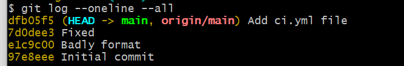

<h1>pre-commit</h1>

#!/bin/sh

echo "🖌️ Checking code format with Prettier..."
npx prettier --check .

if [ $? -ne 0 ]; then
echo "❌ Code is not formatted correctly. Commit aborted."
exit 1
fi

echo "✅ Code is formatted. Proceeding with commit."

 
<h1>pre-push</h1>

#!/bin/sh

echo "🧪 Running tests before push..."
npm test

if [ $? -ne 0 ]; then
echo "❌ Tests failed. Push aborted."
exit 1
fi

echo "✅ Tests passed. Proceeding with push"

  
<ul>

 This is a git log graph all

</ul>
 
 
<ul>

 This is a git reflog

</ul>
 
